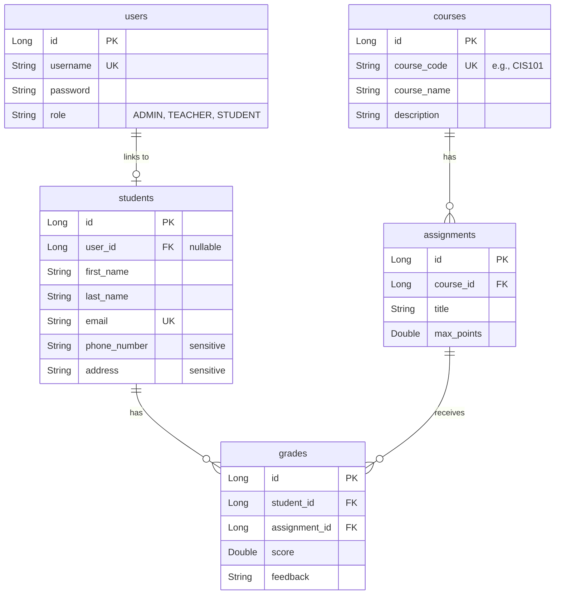

# Student Grade Management System - Backend Implementation Plan

This document outlines the step-by-step design, architecture, and coding details required to build the backend of the Student Grade Management System for Pasadena City College. The backend is built using **Java (Spring Boot)**, **Spring Security with JWT**, and **Hibernate JPA** with **H2/MySQL**.

## User Review Required

> [!IMPORTANT]
> **Key Architecture Decisions**
> 1. **Python Console App Integration**: The prompt requirements specify that the Python console application has "same permission levels as web application" and is a "console application: secure user login and direct database interaction via Python with secure connections". 
>    - *Proposed Approach*: We recommend that the Python application interacts with the database **via the secure REST API** using JWT token authentication rather than direct JDBC/TCP database connection. This ensures centralized business logic, validation, and role-based security rules. Direct database connection from a client application poses security risks and bypasses the backend security layer.
> 2. **Sensitive Fields Restriction**: The fields `address` and `phone_number` in the `Student` entity must not be modifiable by Teachers or Students. We will enforce this at the controller/service layer by validating the user's role before processing updates to these fields.

## Open Questions

> [!NOTE]
> 1. **CSV Ingestion Flow**: When ingestion occurs, if a student or course in the CSV already exists in the database, should we update their details or skip/log a warning?
> 2. **Initial Seeding**: Should we pre-seed the database with demo users (Admin, Teacher, Student) using a startup runner?

---

## Proposed Changes

We will build the backend systematically across the following layers.

### 1. Database Schema & JPA Entities

We will define 5 main tables to model the domain.

#### [NEW] [User.java](file:///d:/Engineering/Programming/student-grade-management-system/src/main/java/edu/pasadena/grademanager/model/User.java)
- Define `User` entity with `id`, `username`, `password`, and `Role` enum.
- Implement Spring Security `UserDetails` interface.

#### [NEW] [Student.java](file:///d:/Engineering/Programming/student-grade-management-system/src/main/java/edu/pasadena/grademanager/model/Student.java)
- Define `Student` entity with fields: `id`, `firstName`, `lastName`, `email`, `phoneNumber`, `address`, and a one-to-one relationship with `User`.

#### [NEW] [Course.java](file:///d:/Engineering/Programming/student-grade-management-system/src/main/java/edu/pasadena/grademanager/model/Course.java)
- Define `Course` entity with `id`, `courseCode` (unique), `courseName`, `description`.

#### [NEW] [Assignment.java](file:///d:/Engineering/Programming/student-grade-management-system/src/main/java/edu/pasadena/grademanager/model/Assignment.java)
- Define `Assignment` entity with `id`, `course` (many-to-one), `title`, `maxPoints`.

#### [NEW] [Grade.java](file:///d:/Engineering/Programming/student-grade-management-system/src/main/java/edu/pasadena/grademanager/model/Grade.java)
- Define `Grade` entity with `id`, `student` (many-to-one), `assignment` (many-to-one), `score`, `feedback`.

---

### 2. JPA Repositories

Create standard repository interfaces extending `JpaRepository` to perform CRUD operations.

#### [NEW] [UserRepository.java](file:///d:/Engineering/Programming/student-grade-management-system/src/main/java/edu/pasadena/grademanager/repository/UserRepository.java)
- Add `Optional<User> findByUsername(String username)`.

#### [NEW] [StudentRepository.java](file:///d:/Engineering/Programming/student-grade-management-system/src/main/java/edu/pasadena/grademanager/repository/StudentRepository.java)
- Add `Optional<Student> findByEmail(String email)`.
- Add `Optional<Student> findByUser(User user)`.

#### [NEW] [CourseRepository.java](file:///d:/Engineering/Programming/student-grade-management-system/src/main/java/edu/pasadena/grademanager/repository/CourseRepository.java)
- Add `Optional<Course> findByCourseCode(String courseCode)`.

#### [NEW] [AssignmentRepository.java](file:///d:/Engineering/Programming/student-grade-management-system/src/main/java/edu/pasadena/grademanager/repository/AssignmentRepository.java)
- Add `List<Assignment> findByCourseId(Long courseId)`.

#### [NEW] [GradeRepository.java](file:///d:/Engineering/Programming/student-grade-management-system/src/main/java/edu/pasadena/grademanager/repository/GradeRepository.java)
- Add `List<Grade> findByStudentId(Long studentId)`.
- Add `Optional<Grade> findByStudentIdAndAssignmentId(Long studentId, Long assignmentId)`.

---

### 3. Security & JWT Configuration

Implement stateless JWT authentication and authorization.

#### [NEW] [JwtUtils.java](file:///d:/Engineering/Programming/student-grade-management-system/src/main/java/edu/pasadena/grademanager/security/JwtUtils.java)
- Provide methods to generate JWT token, parse username from token, and validate token.

#### [NEW] [JwtAuthFilter.java](file:///d:/Engineering/Programming/student-grade-management-system/src/main/java/edu/pasadena/grademanager/security/JwtAuthFilter.java)
- Filter that intercepts HTTP requests, extracts JWT token from the `Authorization: Bearer <token>` header, authenticates the user, and sets it in Spring Security Context.

#### [NEW] [UserDetailsServiceImpl.java](file:///d:/Engineering/Programming/student-grade-management-system/src/main/java/edu/pasadena/grademanager/security/UserDetailsServiceImpl.java)
- Load user details by username from the `UserRepository`.

#### [MODIFY] [SecurityConfig.java](file:///d:/Engineering/Programming/student-grade-management-system/src/main/java/edu/pasadena/grademanager/config/SecurityConfig.java)
- Enable method security via `@EnableMethodSecurity`.
- Configure `SecurityFilterChain` to:
  - Disable CSRF (since we use stateless JWT).
  - Authenticate all `/api/**` requests except `/api/auth/**` and the H2 console `/h2-console/**`.
  - Wire in the `JwtAuthFilter`.

---

### 4. CSV Ingestion Service

#### [NEW] [CsvIngestionService.java](file:///d:/Engineering/Programming/student-grade-management-system/src/main/java/edu/pasadena/grademanager/service/CsvIngestionService.java)
- Parse incoming CSV format (e.g. `student_email,first_name,last_name,course_code,course_name,assignment_title,max_points,score,feedback,phone_number,address`).
- Validate record fields.
- Insert/get matching Student, Course, Assignment, and Grade records.
- Run inside a `@Transactional` block to guarantee database integrity.

---

### 5. Controller Layer & RBAC

Implement REST API controllers with role-based restrictions.

#### [NEW] [AuthController.java](file:///d:/Engineering/Programming/student-grade-management-system/src/main/java/edu/pasadena/grademanager/controller/AuthController.java)
- Expose `/api/auth/login` endpoint to verify credentials and return JWT.
- Expose `/api/auth/register` to register users (only accessible by Admin).

#### [NEW] [StudentController.java](file:///d:/Engineering/Programming/student-grade-management-system/src/main/java/edu/pasadena/grademanager/controller/StudentController.java)
- Expose `/api/students` endpoints.
- Apply RBAC rules:
  - `GET /api/students` (Admin/Teacher: all students; Student: return only their own profile details).
  - `POST /api/students` (Admin/Teacher allowed).
  - `PUT /api/students/{id}`:
    - If modifying `address` or `phoneNumber`, only Admin allowed.
    - Otherwise, Admin and Teacher allowed.
  - `DELETE /api/students/{id}` (Only Admin allowed).

#### [NEW] [GradeController.java](file:///d:/Engineering/Programming/student-grade-management-system/src/main/java/edu/pasadena/grademanager/controller/GradeController.java)
- Expose `/api/grades` endpoints.
- Apply RBAC rules:
  - `GET /api/grades` (Admin/Teacher: view all grades; Student: view only their own grades).
  - `PUT /api/grades/{id}` (Admin/Teacher can update scores; Student forbidden).
  - `POST /api/grades/import` (Admin/Teacher can upload CSV; Student forbidden).

---

### 6. Data Seeding & Initialization

#### [NEW] [DataSeeder.java](file:///d:/Engineering/Programming/student-grade-management-system/src/main/java/edu/pasadena/grademanager/util/DataSeeder.java)
- Implements `CommandLineRunner` to populate initial roles, admin user, test teacher user, and sample student user accounts upon system startup.

---

## Verification Plan

### Automated Tests
- Build verification: Run `./mvnw clean test` to ensure all tests pass.
- Write unit tests for:
  - JWT token generation & parse validation.
  - CSV parsing service to handle valid/invalid CSV records.
  - Method-level security permissions.

### Manual Verification
- Start the server using `./mvnw spring-boot:run`.
- Log in through `/api/auth/login` as Admin, Teacher, and Student.
- Verify JWT validation and endpoint restrictions using Postman or `curl`.
- Open H2 console at `http://localhost:8081/h2-console` to inspect database structure and records.
